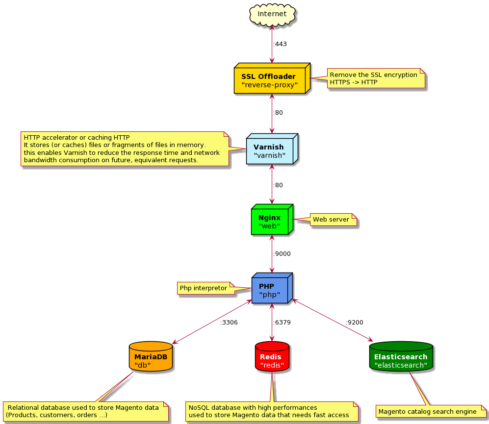

Magento 2 COE Docker Stack
======================

**Tested/compatible with magento versions: 2.4.3 (Adobe Commerce version) **

_Authors : presence@clever-age.com / coe-magento-list@clever-age.com_

This Git repository can be used :

* to spin up a local Magento 2 environment (training...)
* as a fork base to create a docker repository for a Magento 2 project

## Local Magento 2 environnement

* [Installation guide](./doc/install-guide.md) (How to install a local Magento 2 environnement)
* [Usage guide](./doc/usage-guide.md) (How to use the local Magento 2 environnement once it is installed)

## Architectural Scheme

