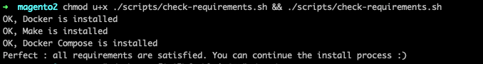
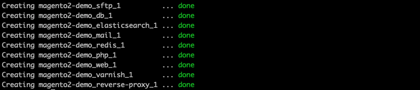
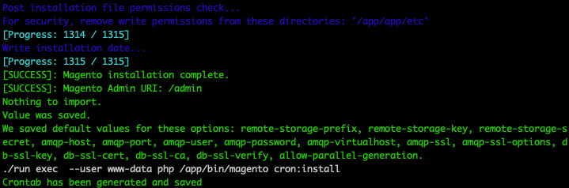

# Install of Magento 2 Docker Stack

This guide will teach you how to have an "Out of the box" Magento 2 developement environment on Linux and Mac OS.

Please follow step by step this guide.

**This doc should be kept in sync with the CI process: [ci-intdev-install.sh](../scripts/ci-intdev-install.sh)**

**Be careful, some commands are only to be executed for Mac OS users.**

## 1. Clone this project

This step will allow you to download on your computer all the tools to create a magento 2 developement environnement.

Make sure you've added an SSH key to your [GitLab profile](https://git.clever-age.net/profile/keys).
 
* Create a folder where you want to install this stack 

_Example : `~/git/PROJECT/docker`_

* Open a shell, go to the created folder and run :

```shell
git clone git@git.clever-age.net:clever-age/expertise/docker/magento2.git docker
```

You should see git downloading the project.

The project has been successfully cloned ! All the docker stuff is in this `docker` folder.

Let's move into this folder :

```shell
cd docker
```

_Example : I am now in `~/git/PROJECT/docker`_

## 2. Check the requirements 

[Install the Requirements](./doc/install-requirements.md)

This step will check if your computer have all tools necessary to make the stack.

Run following command to check the requirements (in the docker directory) :
```shell
chmod u+x ./scripts/check-requirements.sh && ./scripts/check-requirements.sh
```

You should see :



If you don't see the `Perfect : all requirements are satisfied ...` message, please fix errors or ask for help.

## 3. Create or clone Magento source code directory

If starting the stack for an existing magento project, clone it:
```shell
git clone git@git.clever-age.net:PROJECT/magento.git ~/git/PROJECT/magento
```

Otherwise create the directory. From your `docker` folder, run :
```shell
mkdir ../magento
```

Now you have two directories :
* `docker` which contains the Docker Stack for Magento 2
* `magento` that will contain Magento2 source code

_Example : I have now `~/git/PROJECT/docker` and `~/git/PROJECT/magento`_

## 4. Create and check the .env file

The first `make` command will create the `.env` file from `.env.sample`.
```
# from the docker directory
make
```
If you get a warning: `Makefile:17: *** Invalid APP_LOCAL_ROOT (../magento/).`, don't panic, it's ok.

Then edit and review the `.env` file.

**Make sure APP_LOCAL_ROOT points to your magento source code directory, and check the urls.**

```
APP_LOCAL_ROOT=../magento/
```

## 5. Start the Docker stack

This step will create, setup and start the environment

From your `docker` folder, run :
```shell
make startd

You should see : 



Wait a 30 seconds or so. Then check that all the containers are up and running correctly.
```
make ps
```

Docker containers have been successfully created and started, congrats !

_Note : you will see `_sftp_1` only if your are on Mac OS._

## 6a. Install Magento 2 from nothing (if your source code and database are empty)

See section **6b** bellow if installing for an existing project.

Now your environment is ready ! It's now time to install Magento on it. It will download magento, create the database structure ...

To install Magento, just run :
```shell
make magento-install
```

**The installation can take 30 minutes to 1 hour.**

You should see once the installation is complete :



The important message here is `[SUCCESS]: Magento installation complete`. 

Perfect, Magento is successfully installed.

## 6b. Install Magento 2 (existing project source folder)

**IMPORTANT NOTE : for Mac OS, first upload the source code to the magento container (https://git.clever-age.net/ign/docker/-/blob/master/doc/usage-guide.md)**

Run the composer install to download PHP dependencies and Magento:
```
./run exec php composer install
```

Then:
* (early phase of project) if your database is empty and you have no `env.php`, run the magento installer: `make magento-setup-install`
* (project with a reference database) import a reference database and possibly the media assets, and get the `env.php` from the reference environment (future production for example):

```
cd docker
cp -v env.php ../magento/app/etc/env.php

# get the sync-env script
git clone git@git.clever-age.net:PROJECT/sync-env.git ../sync-env

# get the dump + import-magento-db
# OR make magento-import-ref-db (has to be configured)
# be sure to have the qa host in your ssh config
rsync -av PROJECT-qa:dumps/magento.sql.gz ../magento/
./run exec php /scripts/import-magento-db
```

## 7. Disable Magento_TwoFactorAuth module

**In development environment only**. This will avoid the 2fa step when login into the backoffice.

```
# from docker directory
./run exec php bin/magento module:disable Magento_TwoFactorAuth
```

## OK !

You can acces to Magento here :
- [https://magento2-demo.localhost/](https://magento2-demo.localhost/)
- [https://magento2-demo.localhost/admin/](https://magento2-demo.localhost/admin/) `user : admin / password : admin123`

Note : if your browser tell you that there is an invalid certificate, just accept it and continue.

Now that Magento is installed, read the [usage guide](usage-guide.md) to understand how to use this Docker stack.

## Optional : Install Magento 2 Sample Data

Out of the box Magento haven't any data, it's sometime interesting for testing or demo to have sample data.

**This step is optional because Magento already work whitout sample Data.** Magento sample data are demo products, categories and customer used to test Magento.

You can install them by running : 
```shell
make magento-install-sampledata
```

**The installation can take 15 to 30 minutes.**