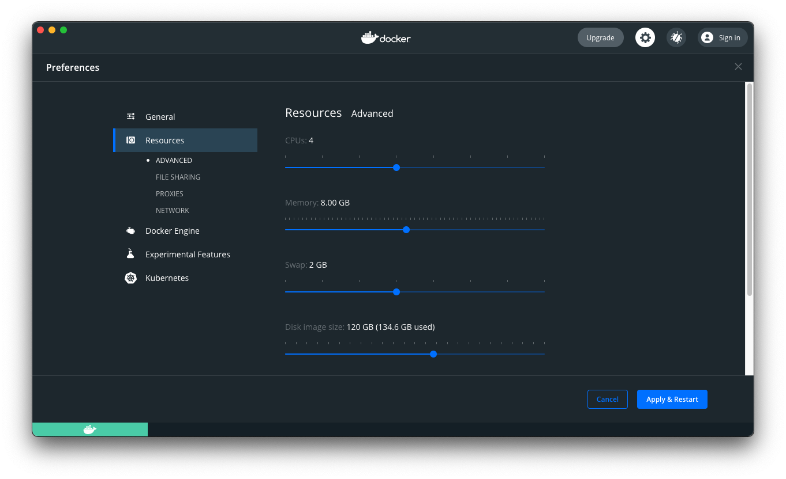

# Install dev stack requirements

In order to install Docker on your PC : https://x2i-fr.atlassian.net/wiki/spaces/TEC/pages/1464467461/Configuration+poste+de+dev

* `make` (apt install make)
* `docker` (latest version from docker.com : https://docs.docker.com/get-docker/)
* `docker-compose` (latest version from docker.com : https://docs.docker.com/compose/install/)

You can also use this script : `bash <(curl -sSL https://intranet.bdx.clever-age.net/kickstarter.sh)`
(Works on Ubuntu & MacOS)

* **Linux**: increase vm.max_map_count for ElasticsSearch
    ```shell
    sudo mkdir -p /etc/sysctl.d
    echo vm.max_map_count=262144 | sudo tee -a /etc/sysctl.d/vm.max_map_count.conf
    sudo sysctl -p
    ```
* **Docker for macOS**: increase `vm.max_map_count` for ElasticSearch
    ```shell
    docker run -it --rm --privileged --pid=host justincormack/nsenter1
    sysctl -w vm.max_map_count=262144
    ```
    Configure minimum 4GB of memory (8GB is better, if you can...) in Docker Desktop Preferences (in Resources submenu).

# Mac OS only : configure Docker

Mac OS need to have more power allocated to docker

**This step is only for MAC OS users.** 

* Open Docker Desktop app
* Go to preferences
* Select ressources and configure it :

    * _CPU : 4_
    * _Memory : 8 GB_
    * _SWAP : 2 GB_
    * _Disk image size : at least 50 GB_
* Clic on `Apply and restart`