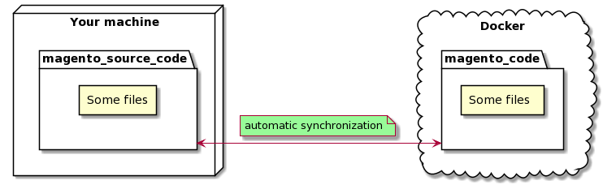
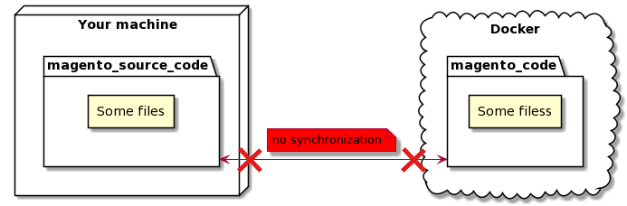
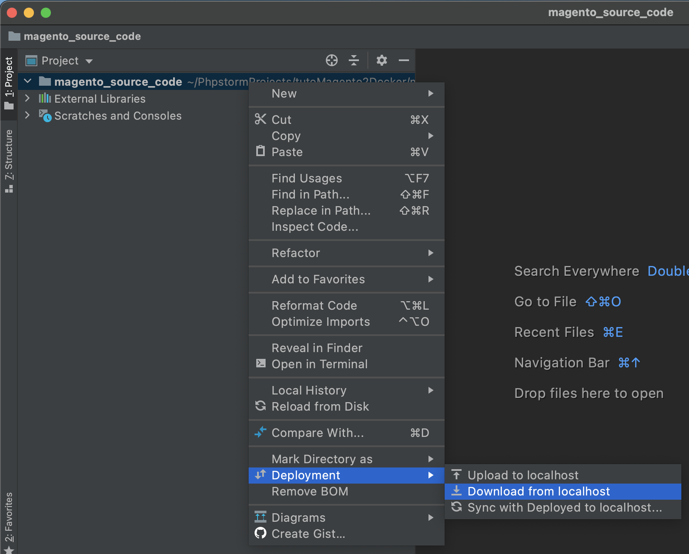
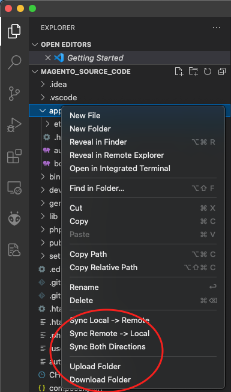
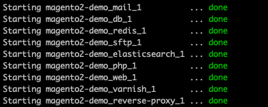
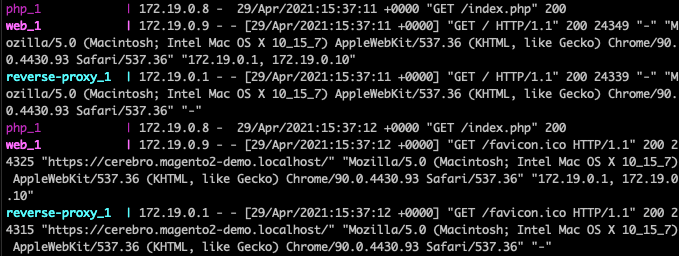

# Usage guide of Magento 2 Docker Stack

## Access the web UIs
You can access to user interfaces with your browser :
- [Magento2 web UI](https://magento2-demo.localhost/)
- [Magento2 admin web UI](https://magento2-demo.localhost/admin/) `user : admin / password : admin123`

A mail catcher is installed. It allows you to catch emails sent by Magento :
- [MailHog web UI](http://localhost:8025)

An Adminer is istalled. It allows you to have a graphic database client :
- [Adminer web UI](http://localhost:8080) `server : db / username : magento / password : magento / database : magento`


## Linux OS : Directory and source code

**IMPORTANT NOTE : following informations only work for Linux OS**

Magento source code is stored in the directory `magento_source_code` in your local machine.

_Example : In my case `/home/amornet/PhpstormProjects/tutoMagento2Docker/magento_source_code/`_

This directory is "duplicated" (as a docker volume) directly in the Docker stack in the `magento_code` directory. It means that if you create / edit / delete a file in `magento_source_code`, it will be automatically created / edited / deleted in the `magento_code` directory (same in reverse).


  
## Mac OS : Directory and source code

**IMPORTANT NOTE : following informations only work for Mac OS**

Magento source code is stored in the directory `magento_source_code` in your local machine.

On MacOS systems, there is no automatic synchronization between `magento_source_code` and the directory used by Docker for the source code :



It means that you need to synchronize manually your local source code and the source code used by Docker. Different ways to do this are described in the following sections.

### Synchronization with docker cp

#### Upload to docker

* Upload :
```
docker cp ../magento_source_code/. magento2-demo_sftp_1:/home/www/magento_code/
```
* and fix permissions :
```
docker exec magento2-demo_sftp_1 chown -R www-data: /home/www/magento_code/
```

#### Download from docker

```docker cp magento2-demo_sftp_1:/home/www/magento_code/. ../magento_source_code/```

TODO : en excluant vendor et var ?

### Synchronization with SFTP

An additional SFTP container is used to upload / download source code files on Docker.

You have to activate file synchronization with your IDE.

#### PHP Storm 

 If you're using Intellij based IDE (like WebStorm or PhpStorm),
you can copy configuration files from the idea/ directory to your .idea/ project directory :
```cp -r idea ../magento_source_code/.idea```

* Open `magento_source_code` with your PHP Storm
* Right click on the directory / file you want to upload / download : 

* Use "Download to localhost" or "Upload to localhost"

Tip : In the top sidebar menu, enable "Automatic Deployment" in Tools > Deployment


#### VS Code

If you're using Visual Studio Code you can copy configuration files from the idea/ directory to your .idea/ project directory :
```cp -r vscode ../magento_source_code/.vscode```

* Install https://marketplace.visualstudio.com/items?itemName=liximomo.sftp
* Right click on the directory / file you want to upload / download : 

* Use "Download" or "Upload"

Tip : if you don't see the upload / download menu, restart VS Code

#### Manual configuration

You can also configure manually with this SFTP configuration :  
    Host : `localhost`  
    Port : `22122`  
    User : `www`  
    Root path : `/magento_code`  
    There is no password, you have to use your SSH key to connect.


## Useful commands

<i class="fas fa-exclamation-triangle"></i> **IMPORTANT NOTE : All of these commands must be launched in the directory where you cloned the stack.**

_Example : I run these commands from `/home/amornet/PhpstormProjects/tutoMagento2Docker/magento2`_

### Start the stack
You must decide if you want to run the stack in the background in a “detached” mode or in the default foreground mode. 

**If you have no idea of what you are doing, start the stack in detached mode.**

There is differences between the 2 modes :
*  **detached** : running in background, no logs

    To run the stack in detached mode, run following command :
    ```shell
    make startd 
    ```
    You will see in your shell that containers are started :
    
    
    _Note : `make upd` will do the same. "startd" mean "start in detached mode"._


* **foreground** : running in foreground with logs in your shell

    To run the stack in foreground mode, run following command :
    ```shell
    make start 
    ```
    You will see in your shell containers logs :
    
    
    _Note : `make up` will do the same. If you type `Control + C` in your shell you will stop the stack_


### Stop the stack

```shell
make stop 
```

### Flush Magento Cache

```shell
make magento-cache-flush 
```

_Note : this command will log in to magento container and run `bin/magento cache:flush`_

### Reindex Magento

```shell
make magento-reindex 
```

_Note : this command will log in to magento container and run `bin/magento indexer:reindex`_

### Magento setup:upgrade

```shell
make magento-setup-upgrade 
```

_Note : this command will log in to magento container and run `bin/magento setup:upgrade`_

### Grunt

Grunt is a tool used to compile `.less` files

#### Configure Grunt
```shell
make grunt-configure
```

#### Grunt watch
```shell
make grunt-watch
```

#### Grunt clean
```shell
make grunt-clean
```

#### Grunt less
```shell
make grunt-less
```

#### Grunt exec
```shell
make grunt-exec
```

### Varnish

Varnish is a tool used as an HTTP accelerator / caching HTTP
It stores (or caches) files or fragments of files in memory. 
this enables Varnish to reduce the response time and network 
bandwidth consumption on future, equivalent requests.
   
#### Flush Varnish
```shell
make varnish-flush
```

#### View logs
```shell
make varnish-log
```

#### Open a shell on Varnish container
```shell
make varnish-shell
```

### Redis

Redis is a NoSQL database with high performances used to store Magento data that needs fast access 

#### Flush all Redis DB
```shell
make redis-flush-all
```

#### Flush specific Redis DB
```shell
make redis-flush-db
```

### Xdebug

Xdebug debugging engine is installed on the stack. You can enable or disable it. If XDebug is enabled but not used, it can cause strong slowdowns.

#### Configure XDebug
* For PHPStorm : https://www.jetbrains.com/help/phpstorm/zero-configuration-debugging.html

#### Enable XDebug
```shell
make xdebug-enable
```

#### Disable XDebug
```shell
make xdebug-disable
```

## Known errors

### Name not resolved

In order to access magento2-demo.localhost on your computer, you can try to add to your /etc/hosts :
```shell
sudo bash -c "echo '127.0.0.1 magento2-demo.localhost admin.magento2-demo.localhost' >> /etc/hosts"
```
